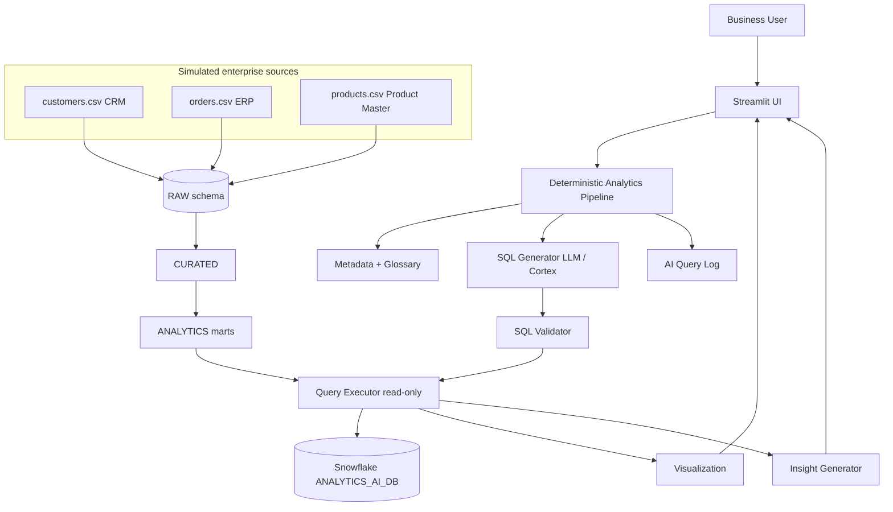

# AI Business Analytics Copilot

Natural-language business analytics over Snowflake for a retail/sales use case.

**Ask a question → generate SQL → validate → run read-only on Snowflake → chart + insight.**

> Status: **Phases 1–7 complete**. Next: full Streamlit chat UI.

---

## 1. Business problem

Business users need answers from CRM, ERP, and Product Master data without writing SQL.
This MVP turns questions like *"What were our top 10 products by sales?"* into safe Snowflake queries
and presents KPIs, tables, charts, and a short business insight.

---

## 2. Architecture



**Design principle:** a clear deterministic pipeline (not an autonomous agent).  
Later, each step becomes a tool (`metadata_tool`, `sql_generation_tool`, …).

| Layer | Schema | Purpose |
|-------|--------|---------|
| Landing | `RAW` | VARCHAR extracts from CRM / ERP / Product Master |
| Entity | `CURATED` | Typed, cleaned `CUSTOMERS`, `ORDERS`, `PRODUCTS` |
| Mart | `ANALYTICS` | `SALES_ANALYTICS`, `CUSTOMER_ANALYTICS`, `PRODUCT_ANALYTICS` |
| Semantic | `AI` | Glossary, table metadata, sample questions, query log |

---

## 3. Project structure

```
genai-prototype/          # AI Business Analytics Copilot
├── app.py                # Streamlit entry (Phase 8)
├── pages/
├── src/                  # Business logic (outside UI)
├── sql/                  # DDL: database, schemas, tables, roles
├── data/                 # customers.csv, orders.csv, products.csv
├── scripts/
│   ├── prepare_data.py   # Split Superstore → 3 source CSVs
│   └── load_data.py      # DDL + load RAW into Snowflake
├── tests/
├── requirements.txt
├── .env.example
└── README.md
```

---

## 4. Data sources

Public **Sample Superstore**-style retail data, split into three logical extracts:

| File | Simulates | Grain |
|------|-----------|-------|
| `data/customers.csv` | CRM | One row per customer |
| `data/orders.csv` | ERP / OMS | One row per order line |
| `data/products.csv` | Product Master | One row per product |

Relationships: `CUSTOMERS.customer_id ← ORDERS.customer_id`, `PRODUCTS.product_id ← ORDERS.product_id`.

---

## 5. Phase roadmap

| Phase | Deliverable | Status |
|------:|-------------|--------|
| 1 | Prepare CSVs + Snowflake `RAW` load | **Done** |
| 2 | Curated + analytics tables/views | **Done** |
| 3 | Business glossary + semantic metadata | **Done** |
| 4 | Snowflake connection (local + SiS) | **Done** |
| 5 | NL → SQL generation | **Done** |
| 6 | SQL validation | **Done** |
| 7 | Query execution | Next |
| 7 | Query execution | Pending |
| 8 | Streamlit UI | Pending |
| 9 | Charts / KPIs | Pending |
| 10 | AI insights | Pending |
| 11 | Default / suggested analytics | Pending |
| 12 | Conversation context | Pending |
| 13 | Logging + tests (25+ questions) | Pending |
| 14 | Deploy Streamlit in Snowflake | Pending |

---

## 6. Phase 1 — Local setup

```bash
cd /Users/sanat/genai-prototype
python3 -m venv venv
source venv/bin/activate
pip install -r requirements.txt

# Create source CSVs (offline Superstore-schema demo by default)
python scripts/prepare_data.py --generate

# Or use an official Tableau Sample Superstore CSV you already have:
# python scripts/prepare_data.py --source /path/to/SampleSuperstore.csv
```

### Snowflake load

1. Copy `.env.example` → `.env` and set account / user / password / warehouse.
2. (Optional) Run `sql/roles.sql` as `ACCOUNTADMIN` to create `ANALYTICS_AI_READONLY` / loader roles.
3. Load:

```bash
python scripts/load_data.py
# or: python scripts/load_data.py --ddl-only
# or: python scripts/load_data.py --load-only
```

This creates:

```
ANALYTICS_AI_DB
├── RAW.CUSTOMERS_RAW
├── RAW.ORDERS_RAW
└── RAW.PRODUCTS_RAW
```

(`CURATED`, `ANALYTICS`, `AI` schemas are created empty for later phases.)

### Phase 4 — connection check

```bash
python scripts/test_connection.py
streamlit run app.py
```

- **Local:** uses `.env` or `.streamlit/secrets.toml`
- **Snowflake Streamlit (warehouse):** uses native `get_active_session()` — no password in the app
- Entry files: `app.py` and `streamlit_app.py` (SiS often expects the latter)
- Packages: `environment.yml` for SiS warehouse runtime

### Phase 5 — NL → SQL

```bash
python scripts/test_sql_generation.py heuristic
# optional: python scripts/test_sql_generation.py snowflake_cortex
```

`generate_sql(question, conversation_context, metadata)` uses:

1. **Snowflake Cortex** (`SNOWFLAKE.CORTEX.COMPLETE`) when `LLM_PROVIDER=snowflake_cortex`
2. **OpenAI** when `LLM_PROVIDER=openai` and `OPENAI_API_KEY` is set
3. **Heuristic templates** as offline / fallback for common retail questions

Unsupported topics (e.g. employee attrition) return `INSUFFICIENT_DATA`.

### Phase 6 — SQL validation

`validate_sql(sql)` strips markdown fences, allows only `SELECT` / `WITH`, rejects
`INSERT`/`UPDATE`/`DELETE`/`DROP`/`ALTER`/`CREATE`/`TRUNCATE`/`MERGE`/`GRANT`/`REVOKE`
and multi-statements, and adds `LIMIT 100` to uncontrolled detail queries.

```bash
python -m pytest tests/test_sql_validator.py -q
```

### Phase 7 — query execution

`execute_query(sql)` validates, runs read-only SQL via Snowpark, returns a pandas
DataFrame, and optionally logs to `ANALYTICS_AI_DB.AI.QUERY_LOG`.

```bash
python -m pytest tests/test_query_executor.py -q
streamlit run app.py   # use "Run on Snowflake"
```

---

## 7. Security (MVP)

- No credentials in source code.
- Local: `.env` / Streamlit secrets.
- App runtime role: **read-only** (`ANALYTICS_AI_READONLY`).
- SQL validator (Phase 6) rejects DML/DDL; only `SELECT` / `WITH`.

---

## 8. Known limitations (expected at Phase 1)

- Streamlit UI and LLM SQL generation are not wired yet.
- Demo data may be synthetic Superstore-schema if you use `--generate` instead of the Tableau file.
- Curated marts and Cortex prompts land in Phases 2–5.

---

## 9. Next step

**Phase 2:** transform `RAW` → typed `CURATED` entities and build `ANALYTICS` marts (`SALES_ANALYTICS`, `CUSTOMER_ANALYTICS`, `PRODUCT_ANALYTICS`).
