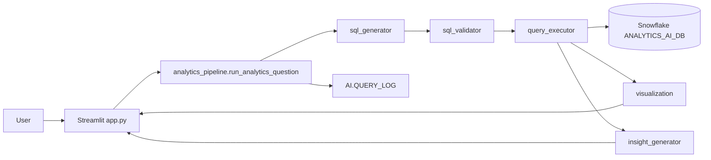

# AI Business Analytics Copilot — Developer & Interview Guide

**Audience:** new developers learning the codebase, and candidates preparing to explain the system in interviews.

**Repo:** [sanat2011/ai-business-analytics-copilot](https://github.com/sanat2011/ai-business-analytics-copilot)

**One-line pitch:** A retail analytics MVP that turns natural-language questions into **validated, read-only Snowflake SQL**, returns results as **KPI / chart / table**, and adds a short **business insight**—without giving the LLM write access to data.

---

## Table of contents

1. [Elevator pitch (30 seconds)](#1-elevator-pitch-30-seconds)
2. [System architecture](#2-system-architecture)
3. [End-to-end request flow](#3-end-to-end-request-flow)
4. [Snowflake data model](#4-snowflake-data-model)
5. [File-by-file map](#5-file-by-file-map)
6. [Core modules & functions (deep dive)](#6-core-modules--functions-deep-dive)
7. [Design decisions you should be able to defend](#7-design-decisions-you-should-be-able-to-defend)
8. [Security model](#8-security-model)
9. [Deployment modes](#9-deployment-modes)
10. [Testing strategy](#10-testing-strategy)
11. [Interview Q&A bank](#11-interview-qampa-bank)
12. [How to onboard in your first day](#12-how-to-onboard-in-your-first-day)

---

## 1. Elevator pitch (30 seconds)

> “I built an AI Business Analytics Copilot for retail Superstore data. Users ask questions in English; the app generates Snowflake SELECT SQL using a semantic glossary, validates that the SQL is read-only, executes it on Snowflake, auto-picks a chart, and writes a short insight from the result only. It’s a **deterministic pipeline**, not an autonomous agent—so it’s easy to audit, secure, and extend into tool-calling later.”

---

## 2. System architecture



### Layers

| Layer | Responsibility |
|-------|----------------|
| **UI** (`app.py`) | Chat, suggested analytics, session memory, render charts/SQL |
| **Orchestration** (`analytics_pipeline.py`) | One turn: generate → validate → execute → viz → insight → log |
| **AI / SQL** (`sql_generator`, `prompts`, `metadata`) | NL→SQL with glossary + schema constraints |
| **Safety** (`sql_validator`) | SELECT/WITH only; reject DML/DDL |
| **Data access** (`snowflake_connection`, `query_executor`) | Session + pandas results |
| **Presentation** (`visualization`, `insight_generator`) | Auto chart + business narrative |
| **Warehouse** (`sql/`, `data/`, `scripts/`) | Medallion RAW → CURATED → ANALYTICS + AI semantic tables |

**Important interview line:** *Business logic lives in `src/`, not in Streamlit widgets.* That keeps UI thin and logic testable.

---

## 3. End-to-end request flow

Example: user clicks **“Top 10 Products by Revenue”** or types the same question.

| Step | Module | What happens |
|------|--------|----------------|
| 1 | `app.py` | Appends user message; builds conversation context from prior turns |
| 2 | `analytics_pipeline.run_analytics_question` | Orchestrates the turn |
| 3 | `sql_generator.generate_sql_detailed` | Produces SELECT SQL (Cortex / OpenAI / **heuristic** fallback) |
| 4 | `sql_validator.validate_sql` | Rejects unsafe SQL; may add `LIMIT` on detail queries |
| 5 | `query_executor.execute_query` | Runs SQL via Snowpark → pandas DataFrame |
| 6 | `visualization.choose_visualization` | Picks `kpi` / `line` / `bar` / `pie` / `table` |
| 7 | `insight_generator.generate_insight` | 2–4 sentences using **only** result values |
| 8 | `query_executor.log_query_event` | Writes observability row to `AI.QUERY_LOG` |
| 9 | `app.py` | Shows chart, insight, expandable **View SQL** |

Follow-up example: *“Now show their profit.”*

- `conversation.py` marks it as a follow-up and resolves entity = `products` from the previous turn.
- `heuristic_sql` rewrites intent to product profit for the same top-N set.

---

## 4. Snowflake data model

```
ANALYTICS_AI_DB
├── RAW          → landing (VARCHAR-safe extracts)
│   ├── CUSTOMERS_RAW   (CRM)
│   ├── ORDERS_RAW      (ERP)
│   └── PRODUCTS_RAW    (Product Master)
├── CURATED      → typed entities
│   ├── CUSTOMERS
│   ├── ORDERS
│   └── PRODUCTS
├── ANALYTICS    → denormalized / aggregated marts (preferred by AI)
│   ├── SALES_ANALYTICS
│   ├── CUSTOMER_ANALYTICS
│   └── PRODUCT_ANALYTICS
└── AI           → semantic + ops
    ├── BUSINESS_GLOSSARY
    ├── TABLE_METADATA
    ├── SAMPLE_QUESTIONS
    └── QUERY_LOG
```

**Why medallion?** Interview answer: separate *ingest safety* (RAW as strings) from *clean models* (CURATED) from *query performance / AI friendliness* (ANALYTICS marts). The LLM is steered to marts so it doesn’t reinvent joins every time.

**Business definitions (glossary):** Revenue = `SUM(sales)`, Profit = `SUM(profit)`, AOV and Profit Margin use `NULLIF` to avoid divide-by-zero.

---

## 5. File-by-file map

### Root / UI

| File | Purpose |
|------|---------|
| `app.py` | Main Streamlit UI: sidebar, suggested analytics, chat, render results |
| `streamlit_app.py` | SiS / Cloud entrypoint; adds project root to `sys.path`, imports `app` |
| `pages/analytics.py` | Secondary page listing the same 12 suggested questions |
| `environment.yml` | Snowflake Streamlit warehouse packages |
| `requirements.txt` | Local Python deps |
| `.env.example` | Documented env vars (never commit real `.env`) |
| `.streamlit/secrets.toml.example` | Template for Streamlit Cloud / local secrets |

### `src/` — application core

| File | Purpose |
|------|---------|
| `analytics_pipeline.py` | Single-turn orchestrator (`run_analytics_question`) |
| `sql_generator.py` | NL → SQL (Cortex / OpenAI / heuristic) |
| `sql_validator.py` | Read-only SQL guardrails |
| `query_executor.py` | Validate + execute + log |
| `snowflake_connection.py` | SiS session vs local/Cloud shared session |
| `metadata.py` | Glossary / table metadata / sample questions accessors |
| `prompts.py` | Strict SQL + insight prompt templates |
| `visualization.py` | Auto chart selection + Plotly/Streamlit render |
| `insight_generator.py` | Business insight text |
| `conversation.py` | Follow-up detection + entity resolution |
| `default_analytics.py` | Canonical 12 suggested analytics |
| `__init__.py` | Package exports |

### `sql/` — warehouse DDL

| File | Purpose |
|------|---------|
| `database.sql` / `schemas.sql` / `tables.sql` | Create DB, schemas, RAW tables |
| `curated.sql` / `analytics.sql` / `views.sql` | CURATED + ANALYTICS marts |
| `metadata.sql` | AI glossary, metadata, sample questions, QUERY_LOG |
| `roles.sql` / `streamlit_grants.sql` | Read-only role + Streamlit grants |
| `bootstrap_ddl.sql` | Combined DDL for Snowsight paste |

### `scripts/` — ops CLIs

| File | Purpose |
|------|---------|
| `prepare_data.py` | Superstore → `customers.csv` / `orders.csv` / `products.csv` |
| `load_data.py` | DDL + RAW load via connector |
| `run_phase2.py` / `run_phase3.py` | Build marts + AI metadata |
| `test_connection.py` | Health check |
| `test_sql_generation.py` | Smoke NL→SQL |
| `run_question_tests.py` | 25-question eval report (`--live` optional) |

### `tests/`

| File | Purpose |
|------|---------|
| `question_catalog.py` | 25 curated eval cases |
| `test_queries.py` | Parametrized SQL characteristic tests |
| `test_*.py` | Unit tests per module |

### `docs/`

| File | Purpose |
|------|---------|
| `DEPLOY_SNOWFLAKE_STREAMLIT.md` | SiS + GitHub deploy |
| `SNOWSIGHT_LOAD.md` | Manual load path |
| `DEVELOPER_INTERVIEW_GUIDE.md` | **This document** |

### `data/`

| File | Purpose |
|------|---------|
| `customers.csv` / `orders.csv` / `products.csv` | Simulated CRM / ERP / Product Master extracts |

---

## 6. Core modules & functions (deep dive)

### 6.1 `app.py` — UI orchestration

**Logic:**

- Holds `st.session_state.messages` (chat history) and `pending_question` (from suggested buttons).
- `_conversation_context()` → compact prior turns for follow-ups.
- `_run_question(question, provider)` → calls pipeline, stores assistant turn + dataframe.
- Renders success path: visualization → **Business Insight** → **View SQL**.

**Interview angle:** Streamlit is the shell; the brain is `run_analytics_question`.

---

### 6.2 `analytics_pipeline.py` — the “agent” as a pipeline

| Symbol | Role |
|--------|------|
| `AnalyticsTurn` | Structured result of one Q&A (sql, df, insight, timings, status) |
| `run_analytics_question(...)` | Main orchestrator |
| `turn_to_history_entry(...)` | Session-state friendly dict |

**Status values:** `success`, `empty`, `insufficient_data`, `validation_failed`, `execution_failed`, `error`.

**Why this matters:** Same function powers chat clicks, suggested analytics, and future API/tools—no duplicated paths.

---

### 6.3 `sql_generator.py` — NL → SQL

| Function | Role |
|----------|------|
| `generate_sql` / `generate_sql_detailed` | Public API |
| `_call_cortex` | `SNOWFLAKE.CORTEX.COMPLETE` |
| `_call_openai` | Chat Completions (optional) |
| `heuristic_sql` | Deterministic templates for common retail questions |
| `_question_unsupported` | Returns `INSUFFICIENT_DATA` for HR/attrition etc. |

**Provider order (typical):** configured provider → on failure, **heuristic fallback** so demos never hard-die without an LLM.

**Heuristic highlights:**

- Aggregations for revenue/profit/region/category/month/year.
- Top-N products/customers.
- Negative profit products.
- Follow-ups via `resolve_follow_up_entity` (products/customers/regions/categories).
- Monthly growth uses Snowflake `LAG` window function.

**Interview line:** *“We constrain the LLM with metadata and a glossary, and we never invent tables. If we can’t answer, we return INSUFFICIENT_DATA instead of hallucinating.”*

---

### 6.4 `sql_validator.py` — safety gate

| Function | Role |
|----------|------|
| `validate_sql` / `validate_sql_detailed` | Main API → `(ok, sql, error)` |
| `_strip_markdown_fences` | Removes \`\`\`sql fences from LLM output |
| `_strip_sql_comments` | Avoid keyword smuggling in comments |
| `_split_statements` | Reject multi-statement scripts |
| `_find_forbidden` | Blocks INSERT/UPDATE/DELETE/DROP/… (ignores string literals) |
| `_maybe_add_limit` | Adds `LIMIT 100` on uncontrolled detail queries |

**Allowed:** single `SELECT` or `WITH` (CTE).  
**Rejected:** DML/DDL, `SELECT INTO`, multiple statements.

**Interview line:** *Defense in depth—prompt rules + validator + preferably read-only Snowflake role.*

---

### 6.5 `query_executor.py` — run + observe

| Symbol | Role |
|--------|------|
| `QueryResult` | ok, dataframe, timings, errors |
| `execute_query` | validate (optional) → Snowpark → pandas |
| `_run_sql` | Executes; retries once if session closed (1404) |
| `log_query_event` | Inserts into `AI.QUERY_LOG` |

**Logged fields:** question, SQL, status, latency ms, row count, error, visualization type.

---

### 6.6 `snowflake_connection.py` — dual runtime

| Function | Role |
|----------|------|
| `running_in_snowflake` | Detect SiS / active Snowpark session |
| `get_session` | SiS: `get_active_session()`; Cloud/local: **one reused session** |
| `healthcheck` | DB/schema/warehouse/role + sales row count |
| `reset_local_session` / `clear_connection_cache` | Recover from closed sessions |

**Critical bug fixed for Streamlit Cloud:** Snowpark allows only one active session per process—creating a second closes the first (`session has been closed` / 1404). Health checks and queries must share one session; never `connection.close()` on the shared connection.

**Modes:**

- **SiS:** no password; viewer’s role.
- **Streamlit Community Cloud / local:** `[snowflake]` secrets or `.env` with password auth.

---

### 6.7 `metadata.py` + `prompts.py` — semantic layer

| Function | Role |
|----------|------|
| `get_business_glossary` | Metric definitions |
| `get_schema_metadata` | Tables/columns/descriptions |
| `format_metadata_for_prompt` | Compact text for the LLM |
| `build_full_sql_prompt` | System rules + glossary + schema + question |

Falls back to local constants if Snowflake metadata is unreachable (offline resilience).

---

### 6.8 `visualization.py` — auto viz

| Function | Role |
|----------|------|
| `choose_visualization` | Rules engine → kpi/line/bar/pie/table |
| `render_visualization` | Streamlit metric / Plotly chart / dataframe |
| `_pick_xy` | Choose category/time vs measure columns |

**Rules (simplified):**

- 1 numeric cell → **KPI**
- Time column + measure → **line**
- Category + measure → **bar**
- Percentage / contribution (small N) → **pie**
- Else / large → **table**

---

### 6.9 `insight_generator.py` — narrative

| Function | Role |
|----------|------|
| `generate_insight` / `generate_insight_detailed` | Public API |
| `heuristic_insight` | Compare top vs second, share of total, negatives—**only from DataFrame** |
| Cortex/OpenAI | Same constraint via prompt: use only provided result preview |

**Interview line:** *Insights are grounded in the query result, not free-form hallucination about the business.*

---

### 6.10 `conversation.py` + `default_analytics.py`

| Function | Role |
|----------|------|
| `is_follow_up` | Detects “their / those / now show…” |
| `infer_entity_from_question` | products / customers / regions / … |
| `resolve_follow_up_entity` | Bind follow-up to last turn’s entity |
| `DEFAULT_ANALYTICS` | Spec’s 12 suggested questions by category |

All suggestions call the **same pipeline**—no hard-coded dashboard pages.

---

### 6.11 Data scripts (worth mentioning)

**`prepare_data.py`**

- Split one Superstore-like dataset into three source CSVs (enterprise simulation).
- Can `--generate` offline or `--source` a real Sample Superstore file.

**`load_data.py`**

- Applies DDL SQL files.
- `write_pandas` into `RAW.*`.
- Supports password or externalbrowser for local admin load.

---

## 7. Design decisions you should be able to defend

| Decision | Why |
|----------|-----|
| Deterministic pipeline, not LangGraph agent (v1) | Auditable, simpler failure modes, faster MVP |
| Prefer ANALYTICS marts over ad-hoc joins | Stable SQL, better performance, less hallucination |
| Heuristic SQL fallback | Demos work without Cortex/OpenAI quotas |
| SQL validator separate from LLM | LLMs can still emit bad SQL; validator is hard gate |
| Shared Snowpark session on Cloud | Avoid 1404 closed-session errors |
| `INSUFFICIENT_DATA` | Explicit refusal > fake answers |
| Thin Streamlit UI | Unit-test core logic without the browser |
| QUERY_LOG | Measure accuracy, latency, popular questions later |

---

## 8. Security model

1. **Prompt contract:** SELECT only; no invented columns/tables.
2. **Validator:** keyword + multi-statement + SELECT INTO rejection.
3. **Role:** `ANALYTICS_AI_READONLY` (SELECT on analytics; INSERT only on `QUERY_LOG`).
4. **Secrets:** never in Git; `.env` local / Streamlit Cloud Secrets / SiS session.
5. **No localhost assumptions** at runtime for SiS path.

---

## 9. Deployment modes

| Mode | Auth | Entry | Notes |
|------|------|-------|-------|
| Local | `.env` password | `streamlit run app.py` | Dev |
| Streamlit Community Cloud | App Secrets `[snowflake]` | `streamlit_app.py` | Label shows Connected (**local**) = not SiS |
| Snowflake Streamlit (SiS) | Active session | `streamlit_app.py` | Warehouse runtime; Git fetch from GitHub |

Docs: `docs/DEPLOY_SNOWFLAKE_STREAMLIT.md`.

---

## 10. Testing strategy

| Layer | How |
|-------|-----|
| Unit | `pytest` on validator, generator, viz, pipeline, insights |
| Catalog | 25 questions in `tests/question_catalog.py` — expected tables/metrics/SQL tokens |
| CLI report | `python scripts/run_question_tests.py` (+ `--live`) |
| Manual acceptance | Suggested analytic → chart → insight → View SQL → follow-up “their profit” |

**Interview line:** *We test SQL characteristics without needing Snowflake for CI; live execution is opt-in.*

---

## 11. Interview Q&A bank

### Q: What problem does this solve?

Business users can’t (or shouldn’t) write SQL. The copilot gives governed answers from Snowflake with transparency (View SQL) and safety (read-only).

### Q: Why not just ChatGPT with a CSV?

Enterprise needs: live warehouse data, access control, audit log, no data exfiltration into a consumer chatbot, reproducible metrics from a glossary.

### Q: How do you stop SQL injection / destructive queries?

LLM is instructed for SELECT-only; validator enforces it; role should be read-only. Multi-statement scripts are rejected.

### Q: How does follow-up context work?

We store compact prior turns (question, SQL, summary, entity). Pronouns like “their” resolve to the last entity (e.g. products) and regenerate appropriate SQL.

### Q: What if the LLM is down?

Heuristic templates cover the demo question set; UI still works on Streamlit Cloud / local.

### Q: How do you choose charts?

Rule-based on dataframe shape + question intent (time → line, category → bar, single metric → KPI, composition → pie).

### Q: How would you productionize further?

- Stronger semantic layer / certified metrics  
- Human-in-the-loop for sensitive SQL  
- Agentic tools (metadata → SQL → validate → execute)  
- Cost/latency dashboards on `QUERY_LOG`  
- Row-access policies / multi-tenant roles  
- Eval harness with golden SQL diffs in CI  

### Q: Walk me through one code path

Start at `app._run_question` → `run_analytics_question` → `generate_sql_detailed` → `execute_query` → `choose_visualization` / `generate_insight` → UI render + `QUERY_LOG`.

### Q: What’s the hardest bug you hit?

On Streamlit Cloud, creating a new Snowpark Session per call closed the previous session (error 1404). Fix: process-wide session reuse + retry on closed session; don’t close the shared connection from metadata helpers.

---

## 12. How to onboard in your first day

1. Read this doc + `README.md` architecture section.  
2. Skim `src/analytics_pipeline.py` (orchestrator).  
3. Trace `sql_generator.heuristic_sql` for “total revenue” and “top products”.  
4. Read `sql_validator.validate_sql_detailed`.  
5. Run:
   ```bash
   python -m pytest tests/test_queries.py tests/test_sql_validator.py -q
   streamlit run app.py
   ```
6. Click **Total Revenue**, then a region question, then a follow-up.  
7. Open `docs/DEPLOY_SNOWFLAKE_STREAMLIT.md` if you need SiS/Cloud deploy.

---

## Appendix A — Glossary of project terms

| Term | Meaning |
|------|---------|
| SiS | Streamlit in Snowflake |
| Medallion | RAW → CURATED → ANALYTICS layering |
| Heuristic SQL | Rule/template SQL without an LLM |
| Cortex | Snowflake LLM functions (`COMPLETE`, etc.) |
| QUERY_LOG | Observability table for AI queries |
| INSUFFICIENT_DATA | Explicit “cannot answer” token |

## Appendix B — Suggested study order (2 hours)

1. Architecture mermaid (10 min)  
2. `analytics_pipeline.py` (20 min)  
3. `sql_generator.py` + `sql_validator.py` (30 min)  
4. `snowflake_connection.py` + Cloud session issue (15 min)  
5. `visualization.py` + `insight_generator.py` (20 min)  
6. Practice elevator pitch + 5 Q&As aloud (25 min)

---

*Document version: aligned with MVP Phases 1–14. Update this file when you add agent tooling or change the pipeline contract.*
